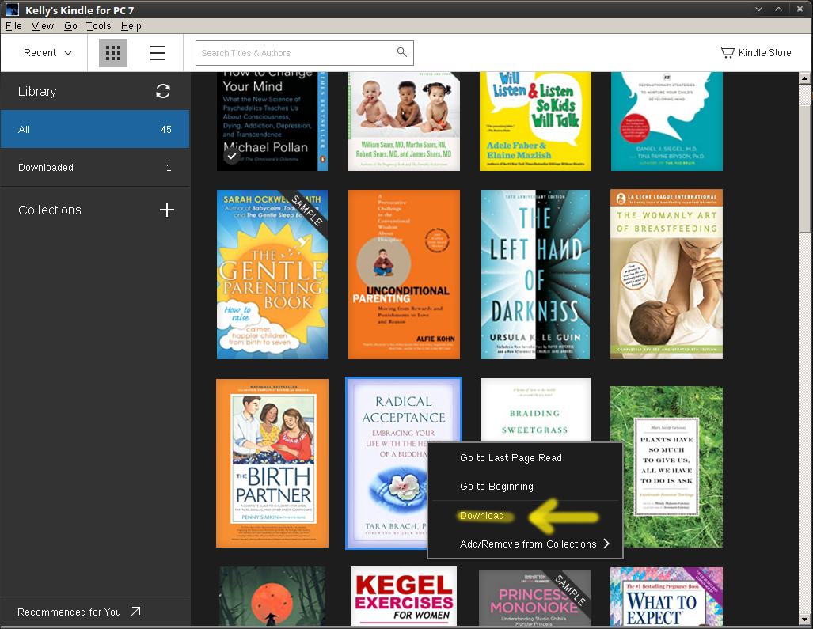
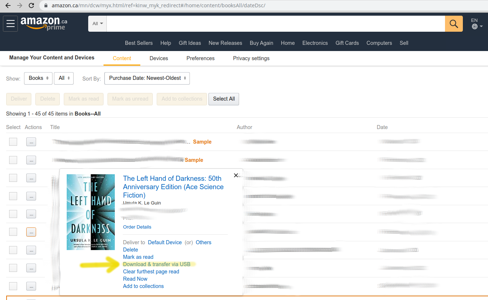

This Docker image allows you to easily read, remove DRM and convert all your Kindle e-books to any other format.

The heavy lifting is done by Calibre + DeDRM plugin. The problem with these tools is that they are difficult to setup, especially on Linux. It can easily take days of effort to figure out all the details to get it working. 

This project automates all of the setup details, so you don't need to worry about it. The image provides the following software, and all of the necessary setup logic to make it all work together:
* Ubuntu Eoan
* Calibre 3.46
  * DeDRM 6.7.0 (plugin)
* Wine 4.0.2
  * Kindle for PC 1.17


# Installation
* Make sure that you have Docker installed (https://docs.docker.com/engine/install/).
   
* Download the driver script: 
   
    https://raw.githubusercontent.com/vace117/calibre-dedrm-docker-image/master/bin/launch_book_manager.sh
   
* Open a terminal and run it:
```text
$ ./launch_book_manager.sh
```

* You'll be asked for your root password. This is needed for setting up permissions on the directory which will be used to store the container's persistent data. The directory created by default will be: `$HOME/Calibre_DeDRM_Volume`

# Setup
The first time you run the image, you'll be taken into setup mode. Just follow the intructions provided by the setup wizard.

The wizard will install and configure all of the necessary software inside the container. Unfortunately installation of Windows applications under Wine is difficult to do without user interaction, so you will see some wizard windows poping up. Just **accept all defaults and keep clicking next**.

The last thing to be installed will be `Kindle for PC 1.17`. When it runs, the fist thing it will do is ask for your Amazon credentials, which you should provide to complete the authentication. If it succeeds, you'll see your entire Kindle library.

# Configure DeDRM with your Kindle's Serial Number
DeDRM needs to be configured with information about your Kindle. The setup will launch Calibre for you, at which point you should go to:
```text
Preferences -> Plugins -> File type plugins -> DeDRM (double-click) -> eInk Kindle ebooks
```
and enter the Serial Number of your Kindle. This number can be found in one of two ways:
* **On the Kindle Device**: Go to `Settings -> Device Options -> Device Info -> Serial Number`
* **On the Amazon website**: Go to `Devices` at https://www.amazon.ca/mn/dcw/myx.html/ref=kinw_myk_redirect

Either way, the Serial Number must be entered without any spaces!

You will now be able to decrypt books downloaded form the Amazon website using the `"Download & transfer via USB"` function (See Usage Instructions below).

# Usage
After the first-time setup `./launch_book_manager.sh` will always launch into a command line, where you can select what you want to do.

## Launching Calibre
```text
$ ./launch_book_manager.sh
$ calibre
```
## Launching Kindle for PC
```text
$ ./launch_book_manager.sh
$ kindle
```

## Importing a book from your Kindle library
There are 2 ways to do this...

### 1) Kindle for PC Method
* Launch `Kindle for PC`
```text
$ ./launch_book_manager.sh
$ kindle
```
* Right-click on a book in your library and select `Download`:

* The book should now appear in the `Downloaded` category
* Close `Kindle for PC`
* Open Calibre:
```text
$ calibre
```
* Go to `Add Books -> My Kindle Content` and select the AZW file downloaded by `Kindle for PC` 

At this point Calibre will launch the DeDRM plugin, which will find the decryption keys used by `Kindle for PC` and use them to decrypt the book. You can monitor the progress in the console from which you launched Calibre.

### 2) Download from Amazon website
If you want to use this method, make sure that you entered the Serial Numbers of your Kindle device, as described above.

* Go to your Amazon library online: https://www.amazon.ca/mn/dcw/myx.html/ref=kinw_myk_redirect
* Find a book you want to download, and select `"Download & transfer via USB"`:

* Save the file into `$HOME/Calibre_DeDRM_Volume/`
* Open Calibre:
```text
$ ./launch_book_manager.sh
$ calibre
```
* Go to `Add Books -> calibre_volume` and select the AZW3 file you just downloaded.

At this point Calibre will launch the DeDRM plugin, which will use the Serial Number you provided to generate decryption keys and decrypt the book. You can monitor the progress in the console from which you launched Calibre.

## Converting the book to another format
After the book was imported into Calibre, you should open it to make sure that Calibre can read it. This confirms that the book was decrypted successfully. 

Now you can right-click on a book and select `Convert books`, which allows you to select the target format.